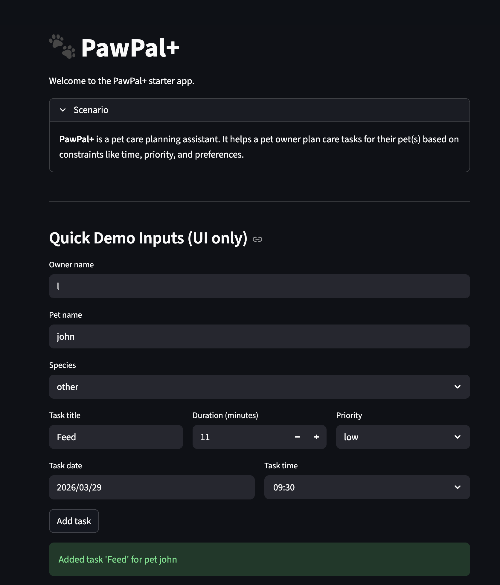
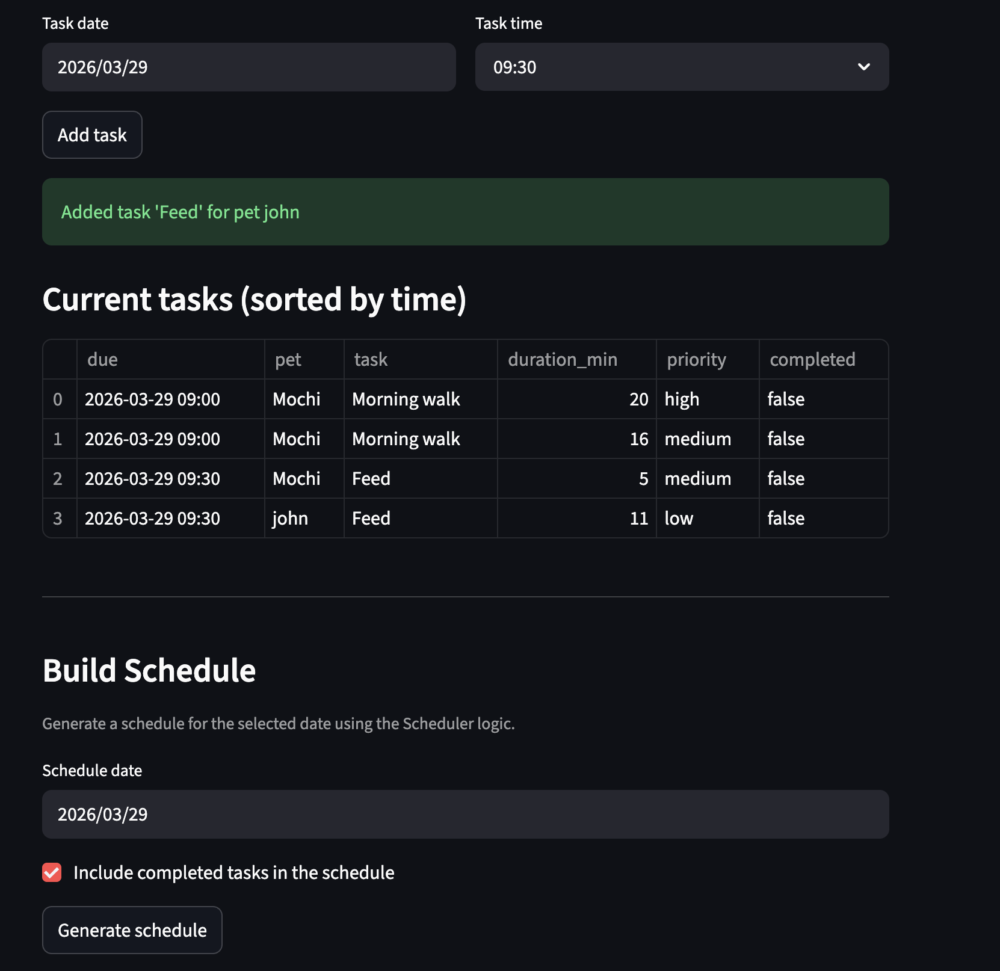
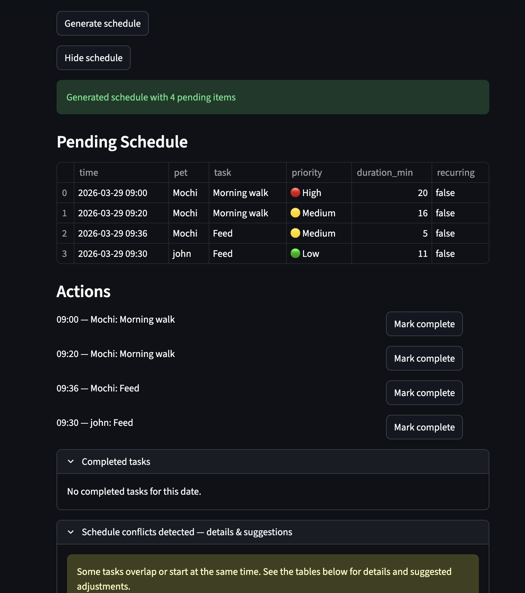
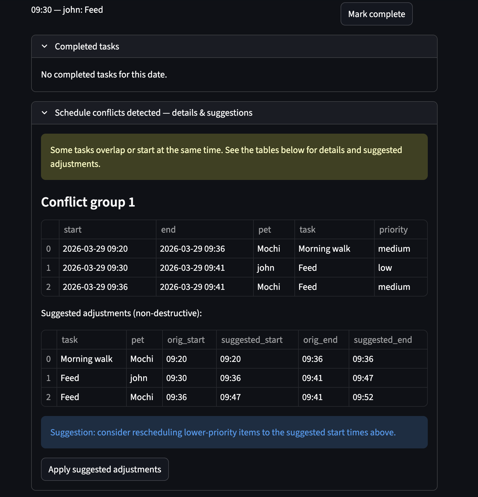
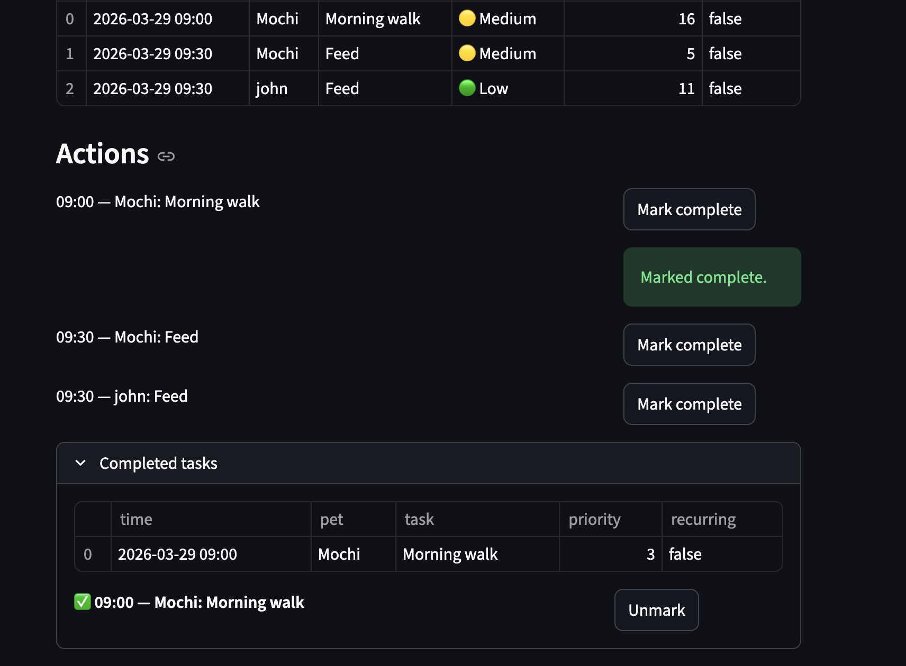
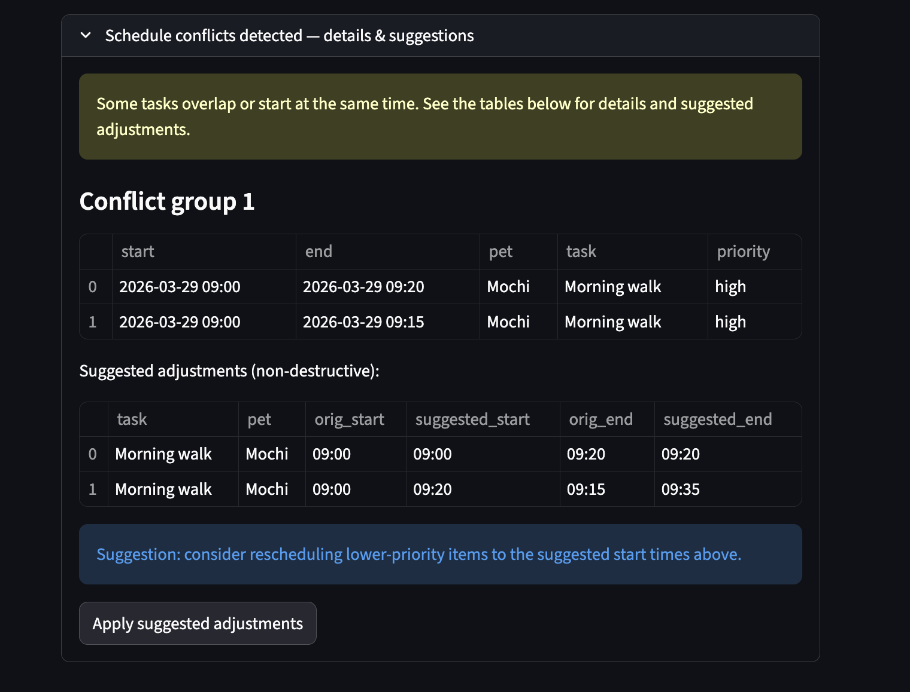

## What you will build

# PawPal+ (Module 2 Project)

You are building **PawPal+**, a Streamlit app that helps a pet owner plan care tasks for their pet.

## Scenario

A busy pet owner needs help staying consistent with pet care. They want an assistant that can:

- Track pet care tasks (walks, feeding, meds, enrichment, grooming, etc.)
- Consider constraints (time available, priority, owner preferences)
- Produce a daily plan and explain why it chose that plan

Your job is to design the system first (UML), then implement the logic in Python, then connect it to the Streamlit UI.

# PawPal+ — Pet care scheduling assistant

PawPal+ is a small Streamlit app that helps pet owners plan and manage daily
pet-care tasks. It implements a lightweight scheduling engine with
prioritization, recurrence, conflict detection, and simple conflict
resolution suggestions. This README acts as a short manual for running,
understanding, and extending the app.

## Features (implemented)

- Sorting by time and priority
	- `Scheduler.sort_by_time` orders tasks by their due-time-of-day.
	- `Scheduler.sort_tasks` and `generate_daily_plan` consider numeric priority
		first (higher integer = higher priority) then time.
- Owner- and pet-level planning
	- `generate_daily_plan(pet, date)` produces a per-pet list of
		`ScheduleItem` objects.
	- `generate_owner_plan(owner, date)` aggregates across pets and returns
		(items, conflict_groups).
- Conflict detection and warnings
	- `detect_conflicts` returns groups of overlapping `ScheduleItem`s.
	- `generate_conflict_warnings` produces human-friendly strings for exact-
		start collisions and overlapping windows.
	- In the Streamlit UI, conflicts are shown in an expander with detailed
		tables and suggested non-destructive adjustments.
- Conflict resolution suggestions
	- `resolve_conflicts` provides naive, non-destructive suggestions by
		shifting later tasks forward to avoid overlaps (preserves caller ordering).
	- The UI offers an "Apply suggested adjustments" action which updates
		`Task.due_date` if the owner accepts the suggestion.
- Recurrence handling
	- Tasks can be `recurring` and/or have a `recurrence` rule (`daily` or
		`weekly`). `Task.mark_complete()` marks the task complete and returns a
		new Task for the next occurrence when applicable.
- Filtering and serialization
	- `Scheduler.filter_tasks` and `Pet.get_tasks(filter=...)` support
		status (pending/completed), date-based filtering, and pet-name filtering
		(owner required).
	- `to_dict` / `from_dict` helpers exist for `Task`, `Pet`, and `Owner`.
- Streamlit UI
	- Add tasks with due date/time, duration and priority via `app.py`.
	- Generate schedules for a chosen date, mark tasks complete, and accept
		suggested adjustments.

## How conflict warnings are presented (UX)

The app presents conflicts in a way designed to be helpful for busy pet
owners:

- Short summary (warning banner): how many tasks conflict and the time window.
- Detailed table: lists each overlapping task with pet, description, original
	start/end and priority.
- Suggested adjustments: a side-by-side table showing original vs suggested
	start/end times produced by `resolve_conflicts`.
- Actions: small buttons to "Apply suggested adjustments" (updates Task
	due_dates) or ignore the suggestion. After applying, a green success banner
	confirms the change and the schedule refreshes.

This format keeps the owner's decisions explicit and reversible (conceptually),
and highlights the least intrusive changes first (short/low-priority tasks).

## Getting started (run locally)

1. Create and activate a virtual environment:

```bash
python3 -m venv .venv
source .venv/bin/activate
```

2. Install dependencies:

```bash
pip install -r requirements.txt
```

3. Run the Streamlit app:

```bash
streamlit run app.py
```

Open the URL printed by Streamlit in your browser (usually http://localhost:8501).

## Running the tests

Run the test suite with pytest:

```bash
pytest -q
```

Tests cover:

- Scheduler ordering and sorting
- Recurrence and mark-complete behavior
- Conflict detection and warning generation

## Files of interest

- `pawpal_system.py` — domain model and scheduler implementation.
- `app.py` — Streamlit UI wiring and interactive flows (add task, generate
	schedule, apply suggestions).
- `tests/` — unit tests covering scheduler behavior.
- `uml_diagram.mmd` — Mermaid UML that documents the final class structure.

## Diagram and design notes

- The UML in `uml_diagram.mmd` reflects the final implementation; render it
	with `mermaid-cli` or view it in any Mermaid-compatible editor.
- The scheduling strategy is intentionally simple and explicit so students
	can extend it (e.g., smarter rescheduling, multiple conflict strategies,
	or a persistent datastore).

## Next improvements (optional)

- Add an "undo" for applied adjustments (store prior due_dates in session)
- Implement smarter conflict resolution that respects owner preferences and
	task priorities beyond naive shifting
- Persist tasks to disk or a small database so schedules survive restarts

If you want me to implement any of these, tell me which and I'll add a
small change and tests.

## 📸 Demo

<div>
	
	
	
	
	
	
</div>
